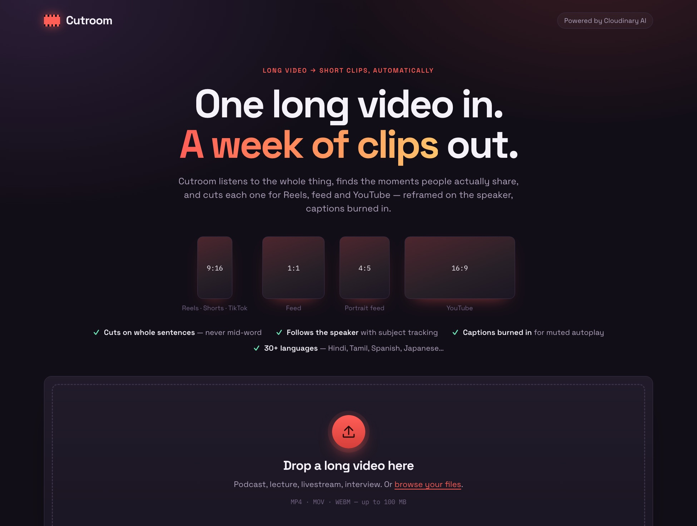
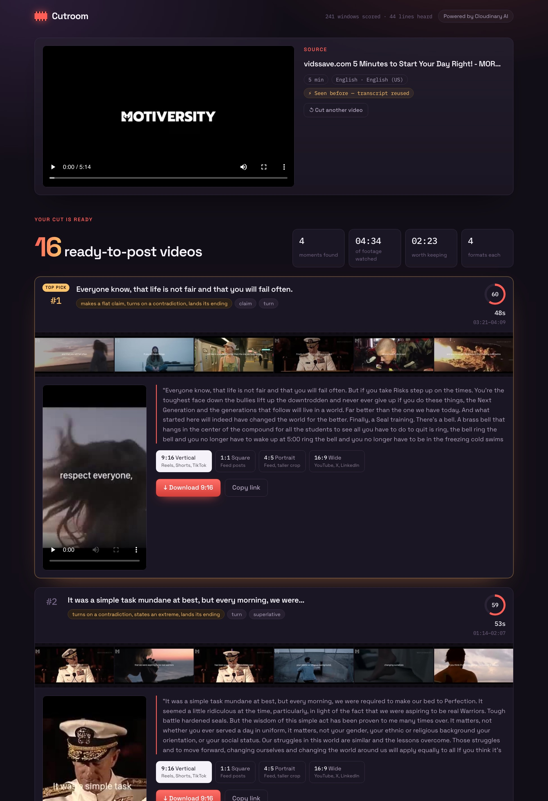
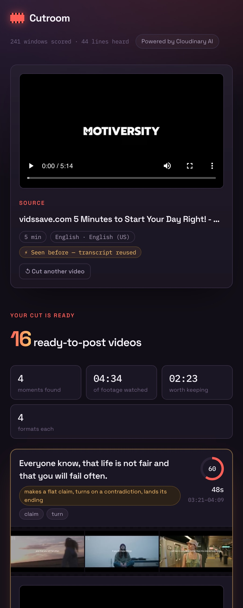

# Cutroom

**One long video in. A week of publishable clips out.**

**▶ Live: [cutroom-1fvh.onrender.com](https://cutroom-1fvh.onrender.com)** — uploads need a passcode; finished results links are open to anyone.

Built for *Pixels to Products — Cloudinary AI Hackathon 2026*, Track 3.

[](https://cutroom-1fvh.onrender.com)

<table>
  <tr>
    <td width="68%"></td>
    <td width="32%"></td>
  </tr>
  <tr>
    <td align="center"><sub>Ranked clips — score, why it was picked, a six-frame filmstrip, and every format ready to download</sub></td>
    <td align="center"><sub>Works on a phone</sub></td>
  </tr>
</table>

---

## The problem

A two-hour podcast contains maybe eight minutes anyone would share. Finding
those eight minutes means scrubbing the whole thing, and then cutting each
moment four more times because Reels, feed, and YouTube all want a different
shape.

Creators either pay an editor or do not post the clips. Most do not post.

## What Cutroom does

Upload the source. Cutroom transcribes it, scores every possible window for
whether it is worth cutting, picks the best non-overlapping moments, and
renders each one for every destination — reframed with subject tracking,
captions burned in, poster frames generated.

Every clip comes with the reason it was chosen.

## The part that is actually ours

`packages/cutplan` is the project. No dependencies, no network, 20 tests.

**Cuts land on speech boundaries.** The naive version chops every sixty
seconds, which is why most auto-clippers produce clips that start mid-word.
Every candidate window here begins and ends on a transcript cue, so a clip is
always a whole set of spoken lines.

**Pace is scored as a curve, not more-is-better.** Dead air and frantic
list-reading are both bad. The score peaks around normal animated speech.

**Hooks are structural, not sentimental.** A question promises an answer. A
number promises specificity. A contradiction promises tension. These are
patterns in the opening line, not a vibe check.

**Endings are scored separately from openings.** This one came out of a failing
test. Averaging filler across a window let a clip open on a great line, trail
off into "um, yeah, anyway", and still win — the dead air got diluted by the
good part. Viewers do not average; they remember the ending. So the last two
sentences are judged on their own terms, and a closing line of four words or
fewer is treated as a trail-off rather than a landing.

**Every pick is explained.** "Opens on a question, has a specific figure, lands
its ending." An unexplained pick is a guess.

## Transform chains worth reading

Order matters and is not obvious:

```
so_12.4,eo_41.9                      cut first, so nothing downstream
                                     re-encodes the whole source
c_fill,g_auto,w_1080,h_1920          reframe, tracking the subject — the
                                     difference between a talking head and
                                     a shot of someone's shoulder
l_subtitles:...,fl_layer_apply,g_south,y_260
                                     burn captions above the platform's own
                                     bottom chrome, because feeds autoplay muted
```

The filmstrip under each clip is six frames pulled from across the segment. It
looks decorative; it is a quality check. A poster frame tells you nothing about
thirty seconds of video — six frames tell you whether the subject tracking
actually held.

## Running it

```bash
cp .env.example .env     # Cloudinary keys
npm install
npm run verify           # ← before anything else
npm run infra            # postgres + redis
npm run dev
```

`npm run verify` times the transcription round trip, which is the long pole and
decides whether you demo live or pre-warm the source.

## Deploying

[](https://render.com/deploy?repo=https://github.com/Mm240/cutroom)

`render.yaml` sets up one web service — the API, the queue worker and the
console together, on one URL — plus Postgres and Key Value (Redis). Render
asks for the Cloudinary keys and an `UPLOAD_PASSCODE`: uploads spend your
Cloudinary credits, so only people with the passcode can upload. Anyone can
open a finished job's link.

On the free plan the service sleeps after 15 idle minutes and takes about a
minute to wake, and the free database expires after 30 days.

## Architecture

```
packages/cutplan      scoring and clip selection — pure TS, 20 tests
apps/api/src          NestJS — upload, BullMQ worker, Cloudinary, job store
apps/web              React + Vite — the cutting room
scripts/verify        Cloudinary capability and latency pre-flight
.github/workflows     CI: tests, typecheck, secret scan
```

## Known limits

- Clip selection scores structure, not meaning. It finds moments that are
  *shaped* like good clips. A language model reading the transcript would catch
  what this misses, and the interface is ready for it — `plan()` takes cues and
  returns scored segments, so a model is a second scorer, not a rewrite.
- Transcription is English-first. Cloudinary supports more; the cue model does
  not care which language it gets.
- Renders are transformation URLs, encoded by Cloudinary on first request. The
  first play of a clip is slower than the rest. Pre-warm before demoing.
- Speaker diarisation would improve cut boundaries on multi-person recordings
  and is not implemented.

## Stack

NestJS · PostgreSQL · Redis · BullMQ · React · Vite · Cloudinary
